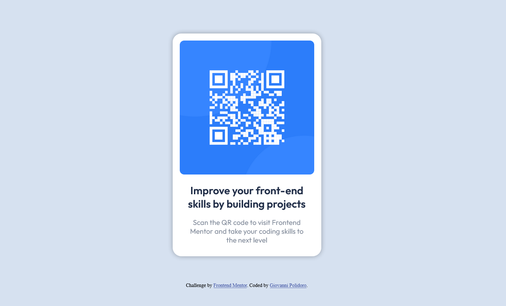

# Card-QR-code

Questa è una soluzione alla sfida del componente del codice QR su Frontend Mentor. Le sfide di www.frontendmentor.io ti aiutano a migliorare le tue capacità di programmazione costruendo progetti realistici.
<h2 align="center">Links</h2>

- Soluzione URL: [Card QR Code  | Frontend Mentor](https://www.frontendmentor.io/solutions/card-qr-code-component-flex-mM50wizkM5)
- Sito URL: https://gialloblink.github.io/Card-QR-code/
